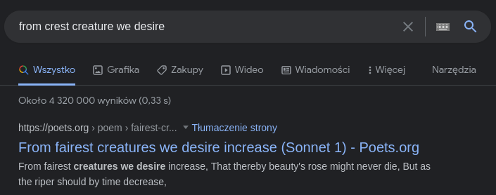

# DIY Crypto

Category: crypto

Files: A python script "crypt.py" and a ciphertext file "crypted.txt"


---
### Solution:
I began by analyzing the `crypt.py` script, which i assumed was used to generate `crypted.txt`. The core encryption process started in line 38:
```python
fh = open("plaintext.txt", 'rb')
plaintext = fh.read()
fh.close()

BLOCK_SIZE = 16
plaintext_padded = plaintext + (BLOCK_SIZE - (len(plaintext) % BLOCK_SIZE)) * b'\x00'

random_key = bytes([random.randrange(0, 256) for _ in range(0, 16)])

block_count = int(len(plaintext_padded) / 16)

print("encrypting %d blocks..." % block_count)
print("using key %s" % random_key.hex())

cur_key = random_key

crypted = b""

for i in range(block_count):
    block = plaintext_padded[i*16:i*16 + 16]
    crypted += crypt_block(block, cur_key)
    cur_key = rotate_key_left(cur_key)
    
print("writing crypted to file...")
fh = open("crypted.txt", 'wb')
fh.write(crypted)
fh.close()
```
The `plaintext.txt` file was read as bytes and padding was appended to it to a multiple of 16 bytes (block size). Afterwards, a random 16 byte key was generated.
The actual encryption loop present in `crypt.py` in lines 56-59 used the `crypt_block()` and `rotate_key_left()` functions, which looked like this:
```python
# AES is supposed to be good?  We can steal their sbox then.
sbox = (
            0x63, 0x7C, 0x77, 0x7B, 0xF2, 0x6B, 0x6F, 0xC5, 0x30, 0x01, 0x67, 0x2B, 0xFE, 0xD7, 0xAB, 0x76,
            # ... many more constants
)

# easy key scheduling
def rotate_key_left(key):
    tmp = bytearray(key[1:])
    tmp.append(key[0])
    return bytes(tmp)

# easy crypto
def crypt_block(block, key):
    global sbox
    retval = bytearray()
    for i in range(0,16):
        retval.append(sbox[block[i] ^ key[i]])
    return bytes(retval)
```
The `rotate_key_left()` function simply took a 16-byte array (the key) and rotated it to the left, with the first element becoming the last.
The `crypt_block()` function first XORed each byte of the current block with corresponding byte of the key, and then used the AES S-BOX to subsitute the value with one from the list.

Overall, each byte of the ciphertext was the result of using an S-BOX on a XOR of a key byte and a plaintext byte. Since the value was not modified anyhow after being passed through the S-BOX, defeating it was as simple as defining an inverse S-BOX function in my `solve.py` script and passing the entirety of the ciphertext through it:
```python
sbox = (
    0x63, 0x7C, 0x77, 0x7B, 0xF2, 0x6B, 0x6F, 0xC5, 0x30, 0x01, 0x67, 0x2B, 0xFE, 0xD7, 0xAB, 0x76,
    # ... same constants as crypt.py
)

# A very simple inverse S-BOX
def inv_sbox(val):
    return sbox.index(val & 0xff) & 0xff

# A function which applies the inverse S-BOX to each byte of a block
def reverse_sbox_block(block):
    retval = bytearray()
    for i in range(0, 16):
        retval.append(inv_sbox(block[i]))
    return bytes(retval)

fh = open("crypted.txt", 'rb')
ciphertext = fh.read()
fh.close()

BLOCK_SIZE = 16

block_count = int(len(ciphertext) / 16)

print("decrypting %d blocks..." % block_count)

pxork_blocks = []

for i in range(block_count):
    block = ciphertext[i*16:i*16 + 16]
    pxork_blocks.append(reverse_sbox_block(block))
```
After reading the bytes of `crypted.txt`, splitting them into blocks and passing each block through the inverse S-BOX i was left with a list of plaintext blocks each XORed with the same key (rotated by different amounts). What came in handy then was the fact that padding in `crypt.py` was made out of zero-value bytes. This meant that most likely some bytes of the last plaintext block were equal to zero. When XORed with the key, the corresponding bytes of ciphertext were set to the bytes of the key, which would allow me to leak part of it.
I created some functions which allowed me to rotate blocks by any number of positions to the left or right and XORed each block with the last (`pxork_blocks[-1]`) with correct rotations. Afterwards i printed the results:
```python
def rotate_block_left(key):
    tmp = bytearray(key[1:])
    tmp.append(key[0])
    return bytes(tmp)

def rotate_block_left_n(block, n):
    for _ in range(0, n):
        block = rotate_block_left(block)

    return block

def rotate_block_right(block):
    tmp = bytearray(block[:-1])
    tmp.insert(0, block[-1])
    return bytes(tmp)

def rotate_block_right_n(block, n):
    for _ in range(0, n):
        block = rotate_block_right(block)

    return block

def xor_blocks(b1, b2):
    return bytes([ a ^ b for (a, b) in zip(b1, b2) ])

for i in range(len(pxork_blocks), 2, -1):
    partially_decrypted_block = xor_blocks(rotate_block_left_n(pxork_blocks[-i], i - 1), pxork_blocks[-1])

    partially_decrypted_block = rotate_block_right_n(partially_decrypted_block, i - 1)
    print(partially_decrypted_block)
```
Since part of the last block was equal to the key, part of each block became decrypted (equal to the plaintext) which looed like this:
```
[msaw328]$ python solve.py 
decrypting 581 blocks...
b'FromE\x11Ocrest cre'
b'atu\x17\x12]*we desire'
b' i\x0b\x14\\oase,\nThat '
b"t\r\x12\\oby beauty's"
b'E\x05Aye might neve'
b'\x05\x0enie,\nBut as t\r'
b'K*riper shouldE\x15'
b's time deceas\x00[$'
b'His tender h\x00\x1e\\*'
b'might bear \r\x1e]*m'

< ... many more blocks to come ... >
```
By looking at the output, i could see english words forming some kind of a text in english. After googling the visible parts of two first blocks i found it:



It was a piece called *"From fairest creatures we desire increase (Sonnet 1)"* by William Shakespear. Now i knew the contents of the first block, which i assumed were equal to the first 16 characters of the piece. this allowed me to find the entirety of the key:
```python
found_first_plaintext_block = b'From fairest cre'

key = xor_blocks(found_first_plaintext_block, pxork_blocks[0])

print('found key:', key)
```

Using the leaked key i was able to decrypt remaining parts of the ciphertext, remove the padding bytes from the end and write the result to a file:
```python
plaintext = b''

cur_key = bytes(key)

for block in pxork_blocks:
    plaintext += xor_blocks(cur_key, block)
    cur_key = rotate_block_left(cur_key)

open('recovered_plaintext.txt', 'w').write(plaintext.rstrip(b'\x00').decode())
```

Afterwards, i found the flag inserted between two lines of the poem:
```
[msaw328]$ grep -A1 -B1 flag recovered_plaintext.txt
They do but sweetly chide thee, who confounds
flag{cRyt0_aNalys1s_101}
In singleness the parts that thou shouldst bear:
```


### Flag: `flag{cRyt0_aNalys1s_101}`
