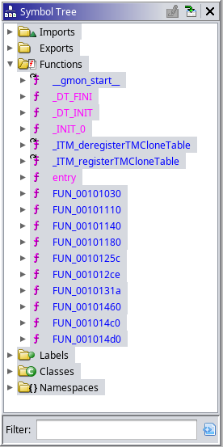

# Time's Up

Category: RE

Endpoint: 0.cloud.chals.io:26020

Files: A single executable called "timesup"


---
### Solution:

My first step was to run the executable to see what it does. Unfortunately, the output was of no help:
```
[msaw328]$ ./timesup
<<< Space Travel require precision.
<<< Current Time Is: 21:00:13
Enter authorization sequence >>> asdgasdhasdh
<<< Authorization sequence not valid.
[msaw328]$
```
After running, the program asked for input. If it found it "not valid" the program exited, which was the case for me with pretty much everything i typed in. The only information given was system time.

This meant that it was time to perform some actual reverse engineering. I imported the file into Ghidra and found the list of functions:



The `_INIT_0()` function only called `setbuf()` on standard IO streams and was of no interest. I found `main()` by following the function pointer passed as the first argument to `__libc_start_main()` in body of `entry()` (`FUN_0010131a`):

```c
void entry(undefined8 param_1,undefined8 param_2,undefined8 param_3)

{
  undefined8 in_stack_00000000;
  undefined auStack8 [8];
  

  __libc_start_main(FUN_0010131a,in_stack_00000000,&stack0x00000008,FUN_00101460,FUN_001014c0,
                    param_3,auStack8);
  do {
                    /* WARNING: Do nothing block with infinite loop */
  } while( true );
}
```

After renaming `FUN_0010131a` to `main` i began analysis. The full contents of the `main()` function before any fix-ups are shown below:

```c
undefined8 main(void)

{
  int iVar1;
  tm *ptVar2;
  undefined4 local_64;
  undefined4 local_60;
  undefined4 local_5c;
  undefined8 local_58;
  ulong local_50;
  undefined8 local_48;
  undefined8 local_40;
  undefined8 local_38;
  long local_30;
  char *local_28;
  time_t local_20 [2];
  
  _INIT_0();
  local_20[0] = time((time_t *)0x0);
  ptVar2 = localtime(local_20);
  local_58 = *(ulong *)ptVar2;
  local_50 = *(ulong *)&ptVar2->tm_hour;
  local_48 = *(undefined8 *)&ptVar2->tm_mon;
  local_40 = *(undefined8 *)&ptVar2->tm_wday;
  local_38 = *(undefined8 *)&ptVar2->tm_isdst;
  local_30 = ptVar2->tm_gmtoff;
  local_28 = ptVar2->tm_zone;
  puts("<<< Space Travel require precision.");
  printf("<<< Current Time Is: %02d:%02d:%02d\n",local_50 & 0xffffffff,local_58 >> 0x20,
         local_58 & 0xffffffff);
  printf("Enter authorization sequence >>> ");
  __isoc99_scanf("%x %x %x",&local_5c,&local_60,&local_64);
  iVar1 = FUN_001012ce(local_5c,local_60,local_64);
  if (iVar1 != 0xa4c570) {
    printf("<<< Authorization sequence not valid.");
                    /* WARNING: Subroutine does not return */
    exit(0);
  }
  if ((local_58._4_4_ < 0x11) || (0x11 < local_58._4_4_)) {
    puts("<<< You failed. Try Another Time.");
  }
  else {
    FUN_0010125c("flag.txt");
  }
  return 0;
}
```

At the very end, the flag is presumably written to the output from the "flag.txt" file by the `FUN_0010125c()` function. I created a mock file on my local machine to test the program. Afterwards i focused on the call to `__isoc99_scanf()` which was clearly the part of code responsible for reading input:
```c
__isoc99_scanf("%x %x %x",&local_5c,&local_60,&local_64);
  iVar1 = FUN_001012ce(local_5c,local_60,local_64);
  if (iVar1 != 0xa4c570) {
    printf("<<< Authorization sequence not valid.");
                    /* WARNING: Subroutine does not return */
    exit(0);
  }
```

Program expected three hexadecimal values separated with spaces, as per the "%x %x %x" format string. Those were then written into three local variables. The `FUN_01012ce()` function was called with the values passed as arguments. If the result of the function was not equal to 0xa4c570 the program exited with the error message seen in the beginning of this writeup. I renamed the function `validate()` and went on to inspect it. After i renamed the parameters it looked like this:

```c
int validate(int a, int b, int c)

{
  return (a + b + c << ((byte)(a % b) & 0x1f)) / (int)((2 << ((byte)a & 0x1f) ^ 3U) * c);
}
```

It's construction is quite complex. While at first i wanted to just brute-force the values, i realized it would take a while. Instead i decided to tackle the problem analytically.

The expression is actually a one large fraction. Mentally i split it into three parts (i omitted the type casts generated by the decompiler):

- The "sum" - `a + b + c` which depends on all three values
- The "shift amount" - `(a % b) & 0x1f` which depeneds only on `a` and `b`
- The "denominator" - `(2 << (a & 0x1f)) ^ 3 * c` which depends only on `a` and `c`

Not all parts of the expression depend on all the variables. Namely, only the sum depends on `b`. This gave me the idea that i might be able to simplify it by fixing some variables to constant values.

Some observations i came up with:
1. The shift amount can easily be set to 0 by making `a` equal to `b * n` for some natural `n` or setting `b` to 1
2. Alternatively, the shift can be set to 1 by setting `a` to 1, as 1 modulo anything is always equal to 1 (1 has no factors besides itself)
3. In the denominator, as long as the "2" is shifted at least 1 place to the left, then the bottom 2 bits of the value will always be set to 1 by `^ 3U`
4. By fixing `a` and `c` to simple values i might practically remove denominator from the equation

As this felt more like a math problem at this point, i decided to grab a piece of paper and a pen and solve it the old-fashioned way :) While i approached the expression in a multitude of ways, i present here the solution that resulted in the flag:

I set `a = 1` and `c = 1`. The former let me eliminate the shift amount completely:

`(a % b) & 0x1f --> (1 % b) & 0x1f --> 1 & 0x1f --> 1`

while both together let me reduce the denominator to a constant:

`(2 << (a & 0x1f)) ^ 3 * c --> (2 << 1) ^ 3 * 1 --> 4 ^ 3 --> 7`

This resulted in expression being reduced to:

`((b + 2) << 1) / 7 --> (2 * b + 4) / 7`

By plugging the 0xa4c570 value found in `main()` into the equation, the formula for `b` was found:

`b = (CONST * 7 - 4) / 2, where CONST = 0xa4c570`

All the calculations and thinking were performed in the math world, which is perfect and allows for perfect divisions and no overflows... but computer world is different. Because of this i first tested my solution using a python script (i recommend testing using C instead, as python integers do not overflow!):

```python
# solve.py
val = 0xa4c570

a = 1
b = (val * 7 - 4) // 2
c = 1
def testfunc(a, b, c):
    return (a + b + c << ((a % b) & 0x1f)) // ((2 << (a & 0x1f) ^ 3) * c)

result = testfunc(a, b, c)

print(val)
print(result, hex(result))

print(hex(a), hex(b), hex(c))
```

The result of running the script proved the solution to be correct:
```
[msaw328]$ python solve.py 
10798448
10798448 0xa4c570
0x1 0x240b306 0x1
[msaw328]$ 
```

This was not the end of analysis. The value was valid, but the `main()` function contained another check (included few relevant lines from earlier in the file):
```c
local_20[0] = time((time_t *)0x0);
ptVar2 = localtime(local_20);
local_58 = *(ulong *)ptVar2;
local_50 = *(ulong *)&ptVar2->tm_hour;
local_48 = *(undefined8 *)&ptVar2->tm_mon;
local_40 = *(undefined8 *)&ptVar2->tm_wday;
local_38 = *(undefined8 *)&ptVar2->tm_isdst;
local_30 = ptVar2->tm_gmtoff;
local_28 = ptVar2->tm_zone;

// ... some code omitted here ...
// ... reading input and validation ...

if ((local_58._4_4_ < 0x11) || (0x11 < local_58._4_4_)) {
  puts("<<< You failed. Try Another Time.");
}
```

When program is ran, it saves current time to a variable `local_20`, which is later converted to a `struct tm* ptVar2` using `localtime()`. Later, the fields of the struct are copied to variables, with `local_58` being the most interesting as it is used later in the check. The decompilation omitted which exact fields are being copied to `local_58`. By searching for `struct tm` definiton i found that the struct begins with the `tm_sec` and `tm_min` fields, which both are 32-bits wide and contain the count of respectively seconds and minutes of the time value. Since the copy is 64-bit wide, as signified by the cast to `(ulong*)` and corresponding disassembly:

```
00101342 e8 f9 fc        CALL       <EXTERNAL>::localtime
         ff ff
00101347 48 8b 08        MOV        RCX,qword ptr [RAX]
```
it means that _both_ fields are copied.

While a clever re-type on `local_58` could have made the decompilation cleaner, it was not necessary. The `local_58._X_Y_` syntax used in the check means that assembly acccesses a value in parts which are smaller than its size. In this example, `_4_4_` means that out of all 8 bytes of `local_58` only 4 (Y) bytes at offset 4 (X) from its beginning address are accessed.

In this case, it meant that the value of the _second_ field was accessed, so `tm_min`. Overall, the `if` checked whether the number of minutes on the clock at the time of running of the program is equal to 17 (0x11 in decimal). So the flag could only be retrieved at 17:17, 18:17, 19:17 and so on.

I will admit here that i got extremely lucky when solving, as i finished my exploit 50 minutes before the end of the CTF. I was done literally 7 minutes before the last opportunity to get the flag :)

Afterwards i finished the exploit, handling connection using the `pwntools` python module:

```python
val = 0xa4c570

a = 1
b = (val * 7 - 4) // 2
c = 1
def testfunc(a, b, c):
    return (a + b + c << ((a % b) & 0x1f)) // ((2 << (a & 0x1f) ^ 3) * c)

result = testfunc(a, b, c)

print(val)
print(result, hex(result))

print(hex(a), hex(b), hex(c))

from pwn import *

#s = process('./timesup')
s = remote('0.cloud.chals.io', 26020)

print(s.readuntil(b'>>> ').decode())

s.writeline('{} {} {}'.format(hex(a), hex(b), hex(c)).encode())

s.interactive()
```

When the clock showed 17 minutes after a full hour, i ran the exploit and retrieved the flag:

```
[msaw328]$ python solve.py
10798448
10798448 0xa4c570
0x1 0x240b306 0x1
[+] Opening connection to 0.cloud.chals.io on port 26020: Done
<<< Space Travel require precision.
<<< Current Time Is: 20:17:01
Enter authorization sequence >>> 
[*] Switching to interactive mode
<<< Congratulations: shctf{b3yond_the_c0rridor_of_R_space_t1me}
```

### Flag: `shctf{b3yond_the_c0rridor_of_R_space_t1me}`
